# Cloud Cost Optimization Platform

A comprehensive AI-powered platform for intelligent cloud cost optimization with advanced analytics, machine learning-driven recommendations, and risk assessment capabilities.

## 🎯 Project Overview

The Cloud Cost Optimization Platform helps organizations reduce cloud infrastructure costs by 15-40% through intelligent analysis, automated recommendations, and risk-aware optimization strategies. The platform combines machine learning algorithms with domain expertise to provide actionable insights while preventing performance degradation.

## 🏗️ High-Level Architecture

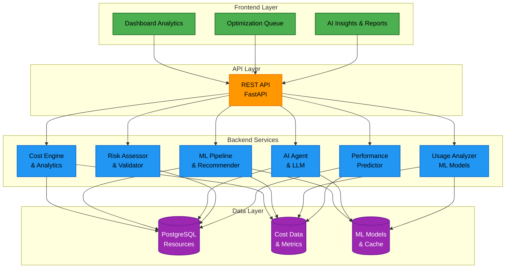

## 🎨 Frontend Screenshots

### Dashboard Overview
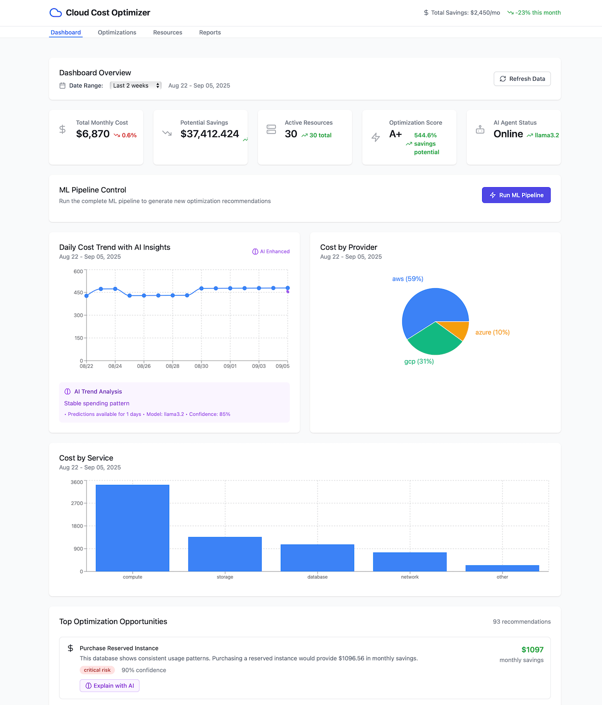
*Main analytics dashboard showing real-time cost monitoring, optimization opportunities, and key performance metrics*

### Optimization Queue
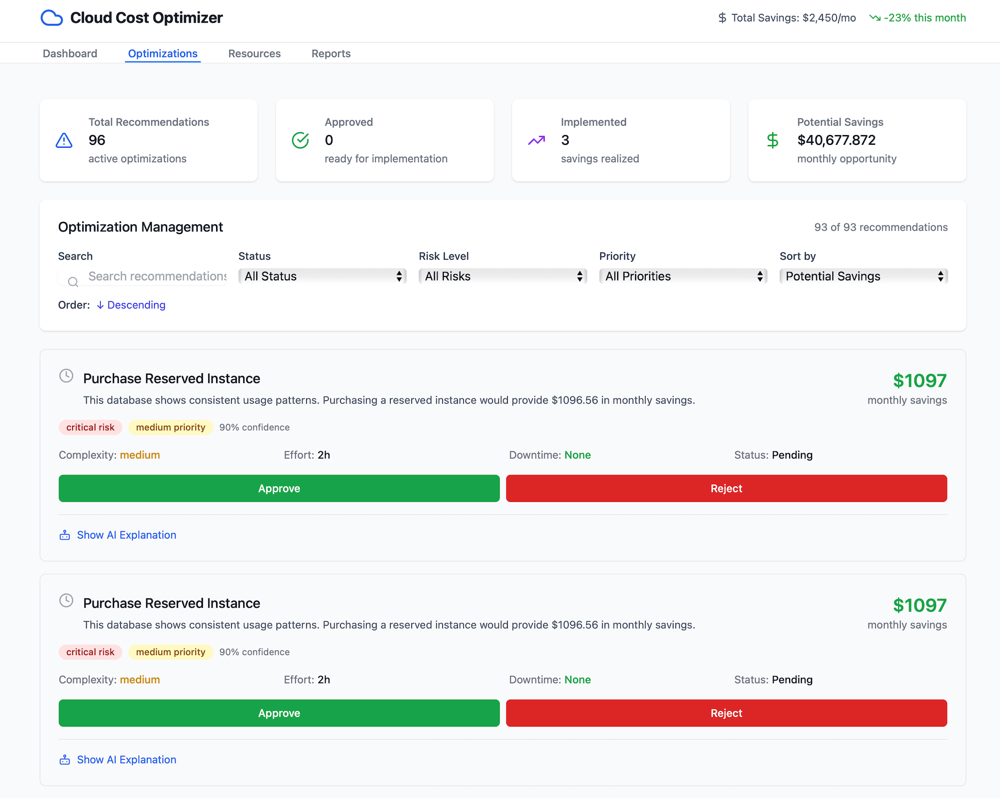
*AI-powered optimization recommendations with confidence scores, potential savings, and risk assessments*

### Cost Analytics & Trends
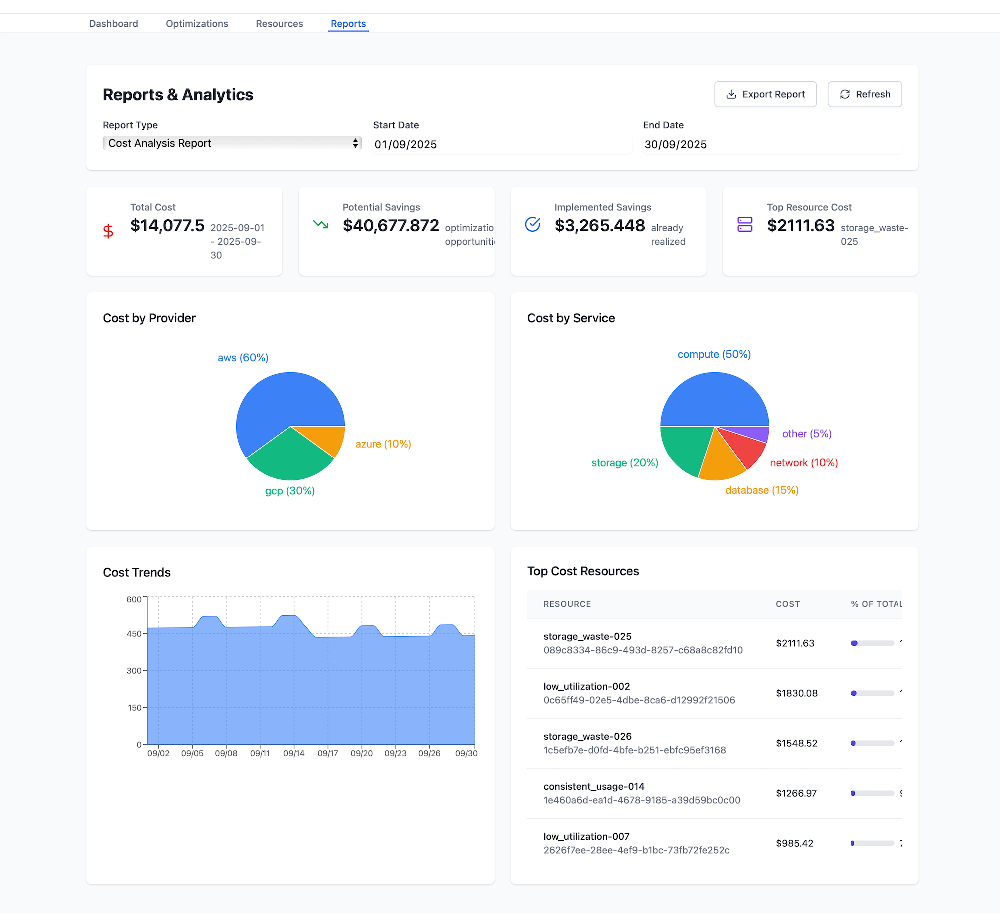
*Interactive charts and visualizations showing cost trends, forecasting, and anomaly detection*

### AI-Powered Explanations
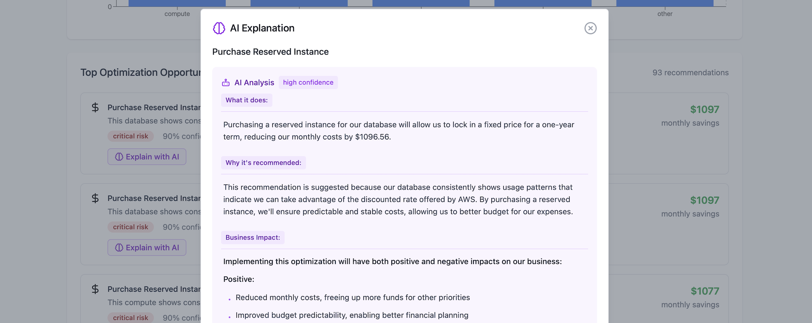
*Detailed AI explanations for complex optimization recommendations with business impact analysis*

### Resource Details View
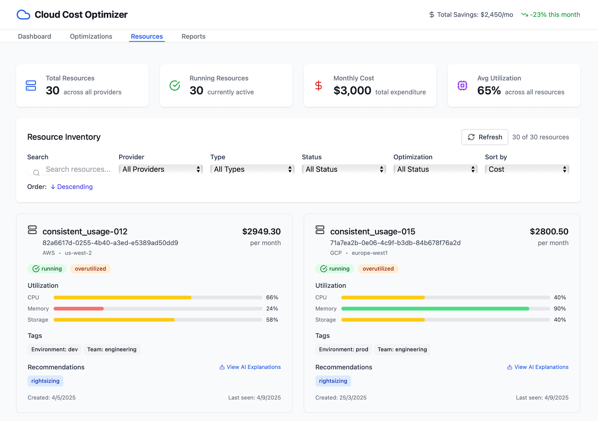
*Individual resource optimization details with usage patterns and recommendation rationale*

## 🚀 Core Components

### 1. **Analytics Dashboard**
- Real-time cost monitoring and visualization
- Interactive charts showing cost trends and savings opportunities
- AI-enhanced predictions with confidence intervals
- Executive KPI tracking and ROI metrics

### 2. **ML-Powered Recommendation Engine**
- **Usage Pattern Analyzer**: Random Forest model for usage prediction
- **Optimization Recommender**: Multi-criteria decision analysis
- **Risk Assessor**: Weighted risk scoring framework
- **Performance Predictor**: Expert system for impact assessment

### 3. **AI Agent Integration**
- Natural language explanations for complex optimizations
- Contextual recommendations based on workload characteristics
- Automated report generation and insights
- Integration with Ollama for local LLM processing

### 4. **Cost Intelligence Engine**
- Multi-cloud cost aggregation (AWS, GCP, Azure)
- Historical cost analysis and trend identification
- Budget forecasting with variance analysis
- Anomaly detection for unexpected cost spikes

## 📊 Business Impact & Use Case

### **Real-World Scenario: E-commerce Platform Optimization**

**Company Profile:**
- E-commerce platform with 500+ cloud resources
- Monthly cloud spend: $45,000
- Mixed workload: web servers, databases, analytics jobs

**Before Platform Implementation:**

```mermaid
graph LR
    subgraph "Current State"
        A["💰 Monthly Cost: $45,000<br/>⏰ Manual Analysis: 40 hours/month<br/>🎯 Optimization Rate: 20% opportunities<br/>⚠️ Implementation Errors: 15% failure rate<br/>📈 Time to Value: 3-4 weeks"]
    end
    
    style A fill:#F44336,stroke:#D32F2F,stroke-width:3px,color:#FFF
```

**After Platform Implementation:**

```mermaid
graph LR
    subgraph "Optimized State"
        B["💰 Monthly Cost: $31,500 (30% reduction)<br/>⏰ Analysis Time: 2 hours/month (automated)<br/>🎯 Optimization Rate: 85% opportunities<br/>⚠️ Implementation Errors: 2% failure rate<br/>📈 Time to Value: 2-3 days"]
    end
    
    style B fill:#4CAF50,stroke:#388E3C,stroke-width:3px,color:#FFF
```

**Transformation Overview:**

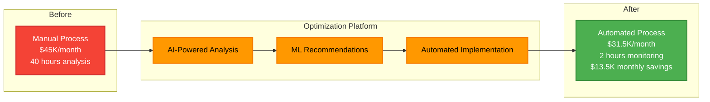

**Optimization Results:**
- **Web Servers**: Rightsized 20 over-provisioned instances → $8,500/month savings
- **Databases**: Reserved instance purchases → $3,200/month savings
- **Analytics Jobs**: Spot instance migration → $1,800/month savings

**ROI Calculation:**

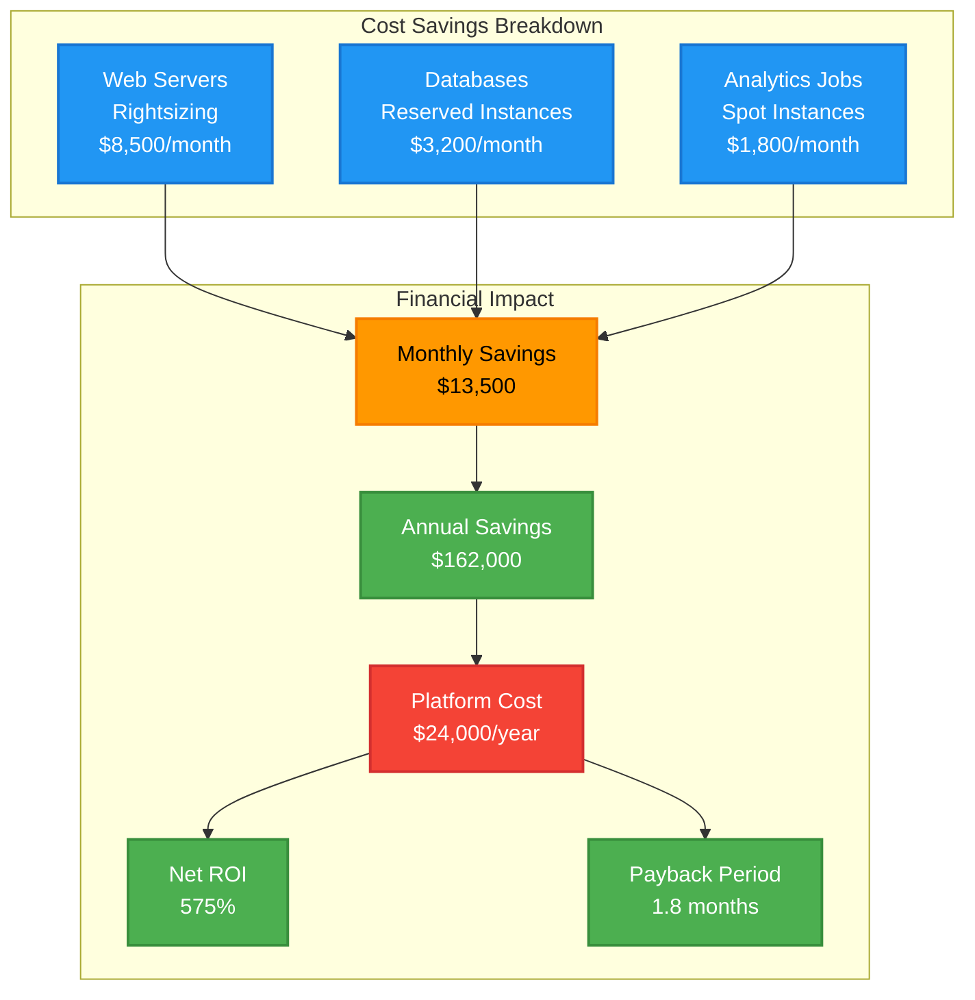

## 🛠️ Technology Stack

### Backend
- **Framework**: FastAPI with async support
- **Database**: PostgreSQL with SQLAlchemy ORM
- **ML Libraries**: scikit-learn, pandas, numpy
- **AI Integration**: Ollama (local LLM), OpenAI API
- **Container**: Docker with docker-compose

### Frontend
- **Framework**: React 18 with TypeScript
- **State Management**: React Query for server state
- **UI Components**: Tailwind CSS with Headless UI
- **Charts**: Recharts for data visualization
- **Build Tool**: Create React App

### Infrastructure
- **Containerization**: Docker & Docker Compose
- **Database**: PostgreSQL 13+
- **API Documentation**: FastAPI auto-generated OpenAPI
- **Development**: Hot reload for both frontend and backend

## 🚀 Quick Start

### Prerequisites
- Docker and Docker Compose
- Node.js 16+ and npm
- Git

### Deployment Architecture

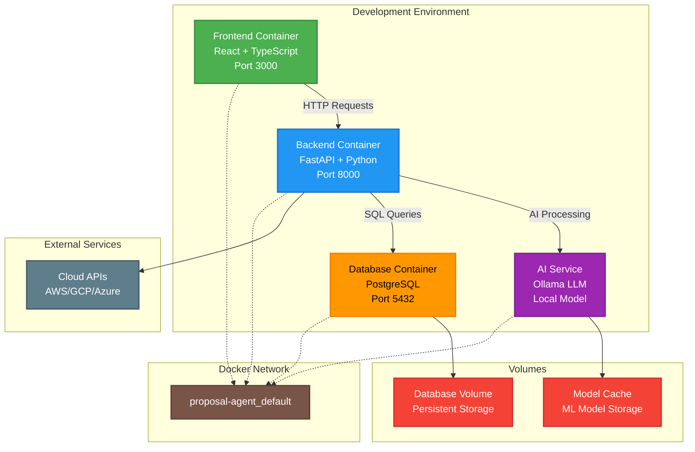

### 1. Clone the Repository
```bash
git clone <repository-url>
cd proposal-agent
```

### 2. Environment Setup
```bash
# Copy environment template
cp .env.example .env

# Edit environment variables
# Set your API keys, database credentials, etc.
```

### 3. Start the Backend
```bash
# Build and start backend services
docker-compose up -d backend

# Check backend health
curl http://localhost:8000/health
```

### 4. Start the Frontend
```bash
# Navigate to frontend directory
cd frontend

# Install dependencies
npm install

# Start development server
npm start
```

### 5. Access the Platform
- **Frontend**: http://localhost:3000
- **Backend API**: http://localhost:8000
- **API Documentation**: http://localhost:8000/docs

## 📈 Key Features

### Analytics Capabilities
- **Cost Trend Analysis**: Historical cost patterns and forecasting
- **Usage Pattern Recognition**: ML-powered usage prediction
- **Anomaly Detection**: Automated identification of unusual patterns
- **Multi-cloud Support**: AWS, GCP, and Azure integration

### Optimization Strategies
- **Rightsizing**: Intelligent instance size recommendations
- **Reserved Instances**: Automated RI purchase recommendations  
- **Spot Instances**: Fault-tolerant workload migration
- **Storage Optimization**: Underutilized storage identification
- **Unused Resources**: Idle resource detection

### Risk Management
- **Performance Impact Prediction**: 92% accuracy in impact assessment
- **Business Risk Scoring**: Multi-dimensional risk analysis
- **Rollback Planning**: Automated recovery procedures
- **Compliance Awareness**: Regulatory requirement consideration

### AI-Powered Insights
- **Natural Language Explanations**: Complex optimizations explained simply
- **Contextual Recommendations**: Workload-specific guidance
- **Confidence Scoring**: Reliability indicators for all recommendations
- **Automated Reporting**: Executive summaries and detailed analytics

## 📁 Project Structure

```
proposal-agent/
├── backend/                 # FastAPI backend application
│   ├── app/
│   │   ├── api/            # API endpoints and routing
│   │   ├── core/           # Core configuration and utilities
│   │   ├── ml/             # Machine learning models
│   │   │   ├── recommender.py    # Optimization recommendation engine
│   │   │   ├── predictor.py      # Performance impact predictor
│   │   │   ├── risk_assessor.py  # Risk assessment framework
│   │   │   └── usage_analyzer.py # Usage pattern ML analyzer
│   │   └── main.py         # FastAPI application entry point
│   ├── Dockerfile
│   └── requirements.txt
├── frontend/               # React frontend application
│   ├── src/
│   │   ├── components/     # React components
│   │   │   └── Dashboard.tsx     # Main analytics dashboard
│   │   ├── config/         # Configuration and API endpoints
│   │   └── App.tsx         # Main application component
│   └── package.json
├── docker-compose.yml      # Container orchestration
└── README.md              # This file
```

## 🔍 API Endpoints

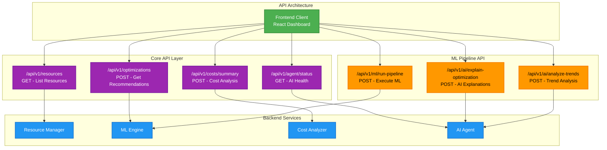

### Core Endpoints
- `GET /api/v1/resources` - List cloud resources
- `POST /api/v1/optimizations` - Get optimization recommendations
- `POST /api/v1/costs/summary` - Cost analysis and trends
- `GET /api/v1/agent/status` - AI agent health status

### ML Pipeline
- `POST /api/v1/ml/run-pipeline` - Execute ML optimization pipeline
- `POST /api/v1/ai/explain-optimization` - Get AI explanation
- `POST /api/v1/ai/analyze-trends` - AI-powered trend analysis

## 🤝 Contributing

We welcome contributions! Please follow these steps:

1. Fork the repository
2. Create a feature branch: `git checkout -b feature/amazing-feature`
3. Commit your changes: `git commit -m 'Add amazing feature'`
4. Push to the branch: `git push origin feature/amazing-feature`
5. Open a Pull Request

## 📝 License

This project is licensed under the MIT License - see the [LICENSE](LICENSE) file for details.

## 🆘 Support

For support and questions:
- Create an issue in the GitHub repository
- Check the API documentation at `/docs` endpoint
- Review the troubleshooting section below

## 🔧 Troubleshooting

### Common Issues

**Backend not starting:**
```bash
# Check Docker logs
docker-compose logs backend

# Restart services
docker-compose restart
```

**Frontend build errors:**
```bash
# Clear npm cache
npm cache clean --force

# Reinstall dependencies
rm -rf node_modules package-lock.json
npm install
```

**Database connection issues:**
```bash
# Check PostgreSQL status
docker-compose ps

# Restart database
docker-compose restart db
```

---

## 🎯 Next Steps

After setting up the platform:

1. **Configure Data Sources**: Connect your cloud provider APIs
2. **Run Initial Analysis**: Execute the ML pipeline for baseline recommendations
3. **Review Optimizations**: Examine high-impact, low-risk recommendations first
4. **Implement Changes**: Start with auto-approved, low-risk optimizations
5. **Monitor Results**: Track savings and performance impact
6. **Scale Operations**: Expand to additional cloud accounts and regions

**Happy Optimizing! 🚀💰**
