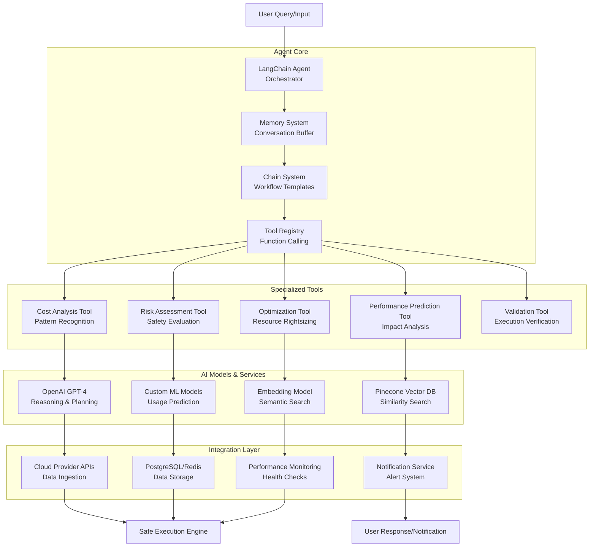
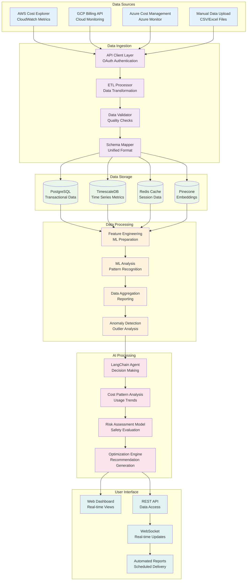
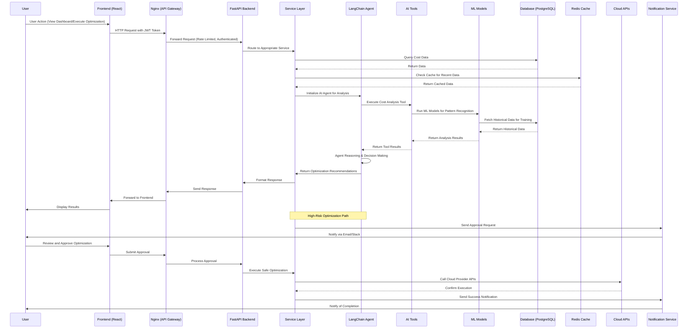

# Cloud Cost Optimizer - Enhanced Architecture Diagram with Mermaid

## System Overview

The Cloud Cost Optimizer is an AI-powered platform that provides intelligent cloud resource management and cost optimization. The system analyzes cloud usage patterns, generates optimization recommendations, and executes safe optimizations with human oversight.

## High-Level Architecture

```mermaid
graph TB
    subgraph "External Systems"
        AWS[AWS APIs<br/>Cost Explorer<br/>CloudWatch]
        GCP[GCP APIs<br/>Billing API<br/>Cloud Monitoring]
        Azure[Azure APIs<br/>Cost Management<br/>Monitor]
        Slack[Slack API]
        Email[Email Services]
    end

    subgraph "Security Layer"
        WAF[Web Application Firewall]
        DDoS[DDoS Protection]
        SSL[SSL/TLS Termination]
        Gateway[API Gateway<br/>Rate Limiting]
        JWT[JWT Authentication]
        CORS[CORS & Input Validation]
    end

    subgraph "Presentation Layer"
        React[React Dashboard]
        TS[TypeScript]
        MUI[Material-UI]
        Charts[Recharts<br/>Data Visualization]
        Router[React Router]
        Query[React Query<br/>State Management]
    end

    subgraph "Application Layer"
        FastAPI[FastAPI Backend]
        Services[Business Services<br/>Cost, Optimization, User]
        Pydantic[Pydantic Models]
        Middleware[Authentication<br/>Logging<br/>CORS]
        Celery[Background Tasks<br/>Celery + Redis]
    end

    subgraph "AI Agent Layer"
        LangChain[LangChain Agent]
        Tools[Specialized Tools<br/>Cost Analysis<br/>Risk Assessment<br/>Optimization]
        Memory[Memory System<br/>Conversation Buffer]
        GPT4[GPT-4 Integration]
        ML[Custom ML Models]
        VectorDB[Vector Database<br/>Pinecone]
    end

    subgraph "Data Layer"
        Postgres[(PostgreSQL<br/>Primary Database)]
        Redis[(Redis<br/>Cache & Sessions)]
        Timescale[(TimescaleDB<br/>Time Series)]
        Pinecone[(Pinecone<br/>Vector DB)]
        ETL[ETL Pipeline]
    end

    subgraph "Infrastructure Layer"
        Docker[Docker Containers]
        K8s[Kubernetes<br/>Orchestration]
        Nginx[Nginx<br/>Reverse Proxy]
        LB[Load Balancer]
        Monitoring[Prometheus<br/>Grafana<br/>ELK Stack]
    end

    AWS --> Gateway
    GCP --> Gateway
    Azure --> Gateway
    Slack --> Gateway
    Email --> Gateway

    Gateway --> WAF
    WAF --> DDoS
    DDoS --> SSL
    SSL --> JWT
    JWT --> CORS

    CORS --> React
    React --> TS
    TS --> MUI
    MUI --> Charts
    Charts --> Router
    Router --> Query

    Query --> FastAPI
    FastAPI --> Services
    Services --> Pydantic
    Pydantic --> Middleware
    Middleware --> Celery

    Celery --> LangChain
    LangChain --> Tools
    Tools --> Memory
    Memory --> GPT4
    GPT4 --> ML
    ML --> VectorDB

    VectorDB --> Postgres
    Postgres --> Redis
    Redis --> Timescale
    Timescale --> Pinecone
    Pinecone --> ETL

    ETL --> Docker
    Docker --> K8s
    K8s --> Nginx
    Nginx --> LB
    LB --> Monitoring

    style AWS fill:#e1f5fe
    style GCP fill:#e1f5fe
    style Azure fill:#e1f5fe
    style Slack fill:#e1f5fe
    style Email fill:#e1f5fe

    style WAF fill:#fff3e0
    style DDoS fill:#fff3e0
    style SSL fill:#fff3e0
    style Gateway fill:#fff3e0
    style JWT fill:#fff3e0
    style CORS fill:#fff3e0

    style React fill:#e8f5e8
    style TS fill:#e8f5e8
    style MUI fill:#e8f5e8
    style Charts fill:#e8f5e8
    style Router fill:#e8f5e8
    style Query fill:#e8f5e8

    style FastAPI fill:#fff8e1
    style Services fill:#fff8e1
    style Pydantic fill:#fff8e1
    style Middleware fill:#fff8e1
    style Celery fill:#fff8e1

    style LangChain fill:#fce4ec
    style Tools fill:#fce4ec
    style Memory fill:#fce4ec
    style GPT4 fill:#fce4ec
    style ML fill:#fce4ec
    style VectorDB fill:#fce4ec

    style Postgres fill:#f3e5f5
    style Redis fill:#f3e5f5
    style Timescale fill:#f3e5f5
    style Pinecone fill:#f3e5f5
    style ETL fill:#f3e5f5

    style Docker fill:#e0f2f1
    style K8s fill:#e0f2f1
    style Nginx fill:#e0f2f1
    style LB fill:#e0f2f1
    style Monitoring fill:#e0f2f1
```

## Detailed Component Architecture

### External Systems Integration

```mermaid
graph TD
    subgraph "Cloud Provider APIs"
        AWSCost[AWS Cost Explorer API]
        AWSCloudWatch[AWS CloudWatch API]
        GCPBilling[GCP Billing API]
        GCPMonitoring[GCP Cloud Monitoring API]
        AzureCost[Azure Cost Management API]
        AzureMonitor[Azure Monitor API]
    end

    subgraph "Communication Platforms"
        SlackAPI[Slack Web API]
        EmailAPI[SMTP/IMAP Services]
        SMSAPI[SMS Gateway API]
        WebhookAPI[Webhook Endpoints]
    end

    subgraph "Authentication Providers"
        GoogleOAuth[Google OAuth 2.0]
        MicrosoftOAuth[Microsoft OAuth 2.0]
        OktaSAML[Okta SAML/OAuth]
        CustomAuth[Custom Authentication]
    end

    AWSCost --> OAuthHandler
    AWSCloudWatch --> OAuthHandler
    GCPBilling --> OAuthHandler
    GCPMonitoring --> OAuthHandler
    AzureCost --> OAuthHandler
    AzureMonitor --> OAuthHandler

    SlackAPI --> APIClient
    EmailAPI --> APIClient
    SMSAPI --> APIClient
    WebhookAPI --> APIClient

    GoogleOAuth --> AuthManager
    MicrosoftOAuth --> AuthManager
    OktaSAML --> AuthManager
    CustomAuth --> AuthManager

    OAuthHandler[OAuth Handler<br/>Token Management]
    APIClient[API Client<br/>Rate Limiting]
    AuthManager[Authentication Manager<br/>SSO Integration]
```

### Security Architecture

```mermaid
graph TD
    subgraph "Perimeter Security"
        WAF[Web Application Firewall<br/>OWASP Rules]
        DDoS[Cloud DDoS Protection<br/>AWS Shield/Cloudflare]
        SSL[SSL/TLS Termination<br/>End-to-End Encryption]
        CDN[Content Delivery Network<br/>Edge Security]
        IPS[Intrusion Prevention<br/>Network Level]
    end

    subgraph "Network Security"
        VPC[Virtual Private Cloud<br/>Network Isolation]
        SecurityGroups[Security Groups<br/>Firewall Rules]
        NACL[Network ACLs<br/>Subnet Protection]
        VPN[VPN Gateway<br/>Secure Remote Access]
    end

    subgraph "Application Security"
        JWTAuth[JWT Authentication<br/>Stateless Tokens]
        RBAC[Role-Based Access Control<br/>Least Privilege]
        RateLimit[Rate Limiting<br/>Abuse Prevention]
        InputVal[Input Validation<br/>XSS/SQL Injection Prevention]
    end

    subgraph "Data Security"
        Encryption[Data Encryption<br/>AES-256 at Rest]
        KeyMgmt[Key Management<br/>HSM Integration]
        AuditLogs[Audit Logging<br/>Security Events]
        DLP[Data Loss Prevention<br/>Sensitive Data Protection]
    end

    Internet[Internet Traffic] --> WAF
    WAF --> DDoS
    DDoS --> SSL
    SSL --> CDN
    CDN --> IPS

    IPS --> VPC
    VPC --> SecurityGroups
    SecurityGroups --> NACL
    NACL --> VPN

    VPN --> JWTAuth
    JWTAuth --> RBAC
    RBAC --> RateLimit
    RateLimit --> InputVal

    InputVal --> Encryption
    Encryption --> KeyMgmt
    KeyMgmt --> AuditLogs
    AuditLogs --> DLP
```

### AI Agent Architecture

## Data Flow Architecture

## Component Interaction Diagram

## Deployment Architecture

```mermaid
graph TB
    subgraph "Load Balancing Layer"
        CloudFront[CloudFront CDN<br/>Global Distribution]
        ALB[Application Load Balancer<br/>Traffic Distribution]
    end

    subgraph "API Gateway Layer"
        Nginx[Nginx Reverse Proxy<br/>SSL Termination<br/>Rate Limiting]
        Kong[Kong API Gateway<br/>Request Routing]
    end

    subgraph "Application Layer"
        subgraph "Frontend Services"
            ReactApp1[React App Instance 1]
            ReactApp2[React App Instance 2]
            ReactApp3[React App Instance 3]
        end

        subgraph "Backend Services"
            FastAPI1[FastAPI Instance 1]
            FastAPI2[FastAPI Instance 2]
            FastAPI3[FastAPI Instance 3]
        end

        subgraph "AI Services"
            LangChain1[LangChain Agent 1]
            LangChain2[LangChain Agent 2]
        end
    end

    subgraph "Data Layer"
        subgraph "Primary Database"
            PostgresMaster[(PostgreSQL Master)]
            PostgresSlave1[(PostgreSQL Slave 1)]
            PostgresSlave2[(PostgreSQL Slave 2)]
        end

        subgraph "Cache Layer"
            RedisCluster1[(Redis Cluster 1)]
            RedisCluster2[(Redis Cluster 2)]
        end

        subgraph "Time Series"
            TimescaleDB[(TimescaleDB)]
        end

        subgraph "Vector Database"
            PineconeDB[(Pinecone)]
        end
    end

    subgraph "Background Processing"
        CeleryWorkers[Celery Workers<br/>Task Processing]
        RedisQueue[(Redis Queue<br/>Task Broker)]
        FlowerMonitor[Flower<br/>Task Monitoring]
    end

    subgraph "Monitoring & Observability"
        Prometheus[Prometheus<br/>Metrics Collection]
        Grafana[Grafana<br/>Visualization]
        AlertManager[AlertManager<br/>Alerting]
        ELKStack[ELK Stack<br/>Logging & Analysis]
    end

    subgraph "External Services"
        OpenAI[OpenAI API<br/>GPT-4 Service]
        AWSAPIs[AWS APIs<br/>Cost & Resource Data]
        GCPAPIs[GCP APIs<br/>Billing & Monitoring]
        AzureAPIs[Azure APIs<br/>Cost Management]
    end

    User[End Users] --> CloudFront
    CloudFront --> ALB
    ALB --> Nginx
    Nginx --> Kong

    Kong --> ReactApp1
    Kong --> ReactApp2
    Kong --> ReactApp3

    Kong --> FastAPI1
    Kong --> FastAPI2
    Kong --> FastAPI3

    FastAPI1 --> LangChain1
    FastAPI2 --> LangChain2
    FastAPI3 --> LangChain1

    LangChain1 --> PostgresMaster
    LangChain2 --> PostgresMaster
    FastAPI1 --> PostgresSlave1
    FastAPI2 --> PostgresSlave2
    FastAPI3 --> PostgresSlave1

    LangChain1 --> RedisCluster1
    LangChain2 --> RedisCluster2
    FastAPI1 --> RedisCluster1
    FastAPI2 --> RedisCluster2
    FastAPI3 --> RedisCluster1

    LangChain1 --> TimescaleDB
    LangChain2 --> TimescaleDB

    LangChain1 --> PineconeDB
    LangChain2 --> PineconeDB

    FastAPI1 --> CeleryWorkers
    FastAPI2 --> CeleryWorkers
    FastAPI3 --> CeleryWorkers
    CeleryWorkers --> RedisQueue
    RedisQueue --> FlowerMonitor

    FastAPI1 --> Prometheus
    FastAPI2 --> Prometheus
    FastAPI3 --> Prometheus
    LangChain1 --> Prometheus
    LangChain2 --> Prometheus
    PostgresMaster --> Prometheus
    RedisCluster1 --> Prometheus
    RedisCluster2 --> Prometheus

    Prometheus --> Grafana
    Prometheus --> AlertManager
    AlertManager --> ELKStack

    LangChain1 --> OpenAI
    LangChain2 --> OpenAI

    LangChain1 --> AWSAPIs
    LangChain2 --> AWSAPIs
    LangChain1 --> GCPAPIs
    LangChain2 --> GCPAPIs
    LangChain1 --> AzureAPIs
    LangChain2 --> AzureAPIs

    style CloudFront fill:#e3f2fd
    style ALB fill:#e3f2fd

    style Nginx fill:#f3e5f5
    style Kong fill:#f3e5f5

    style ReactApp1 fill:#e8f5e8
    style ReactApp2 fill:#e8f5e8
    style ReactApp3 fill:#e8f5e8

    style FastAPI1 fill:#fff8e1
    style FastAPI2 fill:#fff8e1
    style FastAPI3 fill:#fff8e1

    style LangChain1 fill:#fce4ec
    style LangChain2 fill:#fce4ec

    style PostgresMaster fill:#e0f2f1
    style PostgresSlave1 fill:#e0f2f1
    style PostgresSlave2 fill:#e0f2f1

    style RedisCluster1 fill:#e0f2f1
    style RedisCluster2 fill:#e0f2f1

    style TimescaleDB fill:#e0f2f1
    style PineconeDB fill:#e0f2f1

    style CeleryWorkers fill:#fff3e0
    style RedisQueue fill:#fff3e0
    style FlowerMonitor fill:#fff3e0

    style Prometheus fill:#ffebee
    style Grafana fill:#ffebee
    style AlertManager fill:#ffebee
    style ELKStack fill:#ffebee

    style OpenAI fill:#f3e5f5
    style AWSAPIs fill:#f3e5f5
    style GCPAPIs fill:#f3e5f5
    style AzureAPIs fill:#f3e5f5
```

## Security Architecture

```mermaid
graph TD
    subgraph "Defense in Depth"
        subgraph "Layer 1: Perimeter"
            WAF[Web Application Firewall<br/>OWASP Rules]
            DDoS[Cloud DDoS Protection<br/>AWS Shield/Cloudflare]
            SSL[SSL/TLS Termination<br/>End-to-End Encryption]
            CDN[Content Delivery Network<br/>Edge Security]
            IPS[Intrusion Prevention<br/>Network Level]
        end

        subgraph "Layer 2: Network"
            VPC[Virtual Private Cloud<br/>Network Isolation]
            SecurityGroups[Security Groups<br/>Instance Level Firewall]
            NACL[Network ACLs<br/>Subnet Level]
            VPN[VPN Gateway<br/>Secure Remote Access]
        end

        subgraph "Layer 3: Application"
            JWTAuth[JWT Authentication<br/>Stateless Tokens]
            RBAC[Role-Based Access Control<br/>Least Privilege]
            RateLimit[Rate Limiting<br/>Abuse Prevention]
            InputVal[Input Validation<br/>XSS/SQL Injection Prevention]
        end

        subgraph "Layer 4: Data"
            Encryption[Data Encryption<br/>AES-256 at Rest]
            KeyMgmt[Key Management<br/>HSM Integration]
            AuditLogs[Audit Logging<br/>Security Events]
            DLP[Data Loss Prevention<br/>Sensitive Data Protection]
        end
    end

    subgraph "Security Monitoring"
        SIEM[SIEM System<br/>Security Event Correlation]
        IDS[Intrusion Detection<br/>Real-time Monitoring]
        LogAnalysis[Log Analysis<br/>Anomaly Detection]
        Compliance[Compliance Monitoring<br/>Automated Audits]
    end

    subgraph "Incident Response"
        Alerting[Automated Alerting<br/>Multi-channel]
        Isolation[Threat Isolation<br/>Network Segmentation]
        Forensics[Digital Forensics<br/>Evidence Collection]
        Recovery[Automated Recovery<br/>Failover Procedures]
    end

    Internet[Internet Traffic] --> WAF
    WAF --> DDoS
    DDoS --> SSL
    SSL --> CDN
    CDN --> IPS

    IPS --> VPC
    VPC --> SecurityGroups
    SecurityGroups --> NACL
    NACL --> VPN

    VPN --> JWTAuth
    JWTAuth --> RBAC
    RBAC --> RateLimit
    RateLimit --> InputVal

    InputVal --> Encryption
    Encryption --> KeyMgmt
    KeyMgmt --> AuditLogs
    AuditLogs --> DLP

    DLP --> SIEM
    SIEM --> IDS
    IDS --> LogAnalysis
    LogAnalysis --> Compliance

    Compliance --> Alerting
    Alerting --> Isolation
    Isolation --> Forensics
    Forensics --> Recovery

    Recovery --> VPC

    style WAF fill:#ffebee
    style DDoS fill:#ffebee
    style SSL fill:#ffebee
    style CDN fill:#ffebee
    style IPS fill:#ffebee

    style VPC fill:#e3f2fd
    style SecurityGroups fill:#e3f2fd
    style NACL fill:#e3f2fd
    style VPN fill:#e3f2fd

    style JWTAuth fill:#e8f5e8
    style RBAC fill:#e8f5e8
    style RateLimit fill:#e8f5e8
    style InputVal fill:#e8f5e8

    style Encryption fill:#fff3e0
    style TLS fill:#fff3e0
    style KeyMgmt fill:#fff3e0
    style AuditLogs fill:#fff3e0
    style DLP fill:#fff3e0

    style SIEM fill:#fce4ec
    style IDS fill:#fce4ec
    style LogAnalysis fill:#fce4ec
    style Compliance fill:#fce4ec

    style Alerting fill:#e0f2f1
    style Isolation fill:#e0f2f1
    style Forensics fill:#e0f2f1
    style Recovery fill:#e0f2f1
```

## Technology Stack Summary

### Frontend Technologies
- **React 18** - Component-based UI framework
- **TypeScript** - Type-safe JavaScript development
- **Material-UI** - Design system and component library
- **Tailwind CSS** - Utility-first CSS framework
- **React Query** - Data fetching and state management
- **Recharts** - Data visualization library

### Backend Technologies
- **FastAPI** - High-performance async web framework
- **Python 3.11** - Core programming language
- **Pydantic** - Data validation and serialization
- **SQLAlchemy** - Database ORM and query builder
- **Alembic** - Database migration tool

### AI/ML Technologies
- **LangChain** - LLM application framework
- **OpenAI GPT-4** - Large language model for reasoning
- **Scikit-learn** - Machine learning algorithms
- **Pinecone** - Vector database for embeddings
- **Pandas/NumPy** - Data processing and analysis

### Database Technologies
- **PostgreSQL 15** - Primary relational database
- **Redis 7** - In-memory data store and cache
- **TimescaleDB** - Time-series database extension
- **pgvector** - Vector similarity search for PostgreSQL

### Infrastructure Technologies
- **Docker** - Containerization platform
- **Kubernetes** - Container orchestration
- **Nginx** - Web server and reverse proxy
- **Prometheus** - Monitoring and alerting
- **Grafana** - Metrics visualization
- **ELK Stack** - Log aggregation and analysis

### Security Technologies
- **JWT** - JSON Web Tokens for authentication
- **bcrypt** - Password hashing
- **OAuth 2.0** - Authorization framework
- **SSL/TLS** - Transport layer security
- **OWASP ZAP** - Security testing and scanning

## Performance Characteristics

### Scalability Metrics
- **Concurrent Users**: Support for 10,000+ active users
- **API Throughput**: 10,000+ requests per minute
- **Data Processing**: Process 1TB+ of cloud cost data daily
- **AI Inference**: <2 second response time for optimization recommendations

### Reliability Metrics
- **Uptime SLA**: 99.9% service availability
- **Data Durability**: 99.999999999% (11 9's) data durability
- **Recovery Time**: <15 minutes for service restoration
- **Backup Frequency**: Continuous data backup with point-in-time recovery

### Security Metrics
- **Encryption**: AES-256 encryption for data at rest and in transit
- **Compliance**: SOC 2 Type II, GDPR, and HIPAA compliant
- **Vulnerability**: <24 hours response time for critical vulnerabilities
- **Access Control**: Role-based access with least privilege principles

This enhanced architecture diagram uses Mermaid syntax to provide clear, visual representations of the Cloud Cost Optimizer system architecture. The diagrams show the relationships between components, data flows, security measures, and deployment considerations with proper styling and color coding for different architectural layers.
